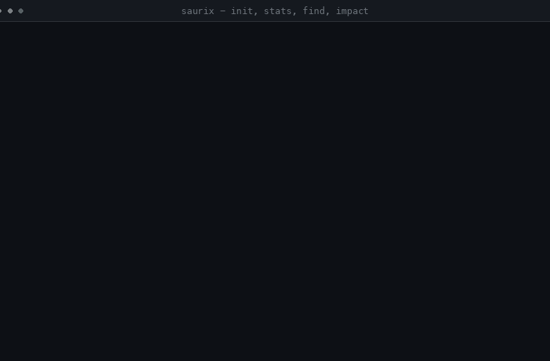
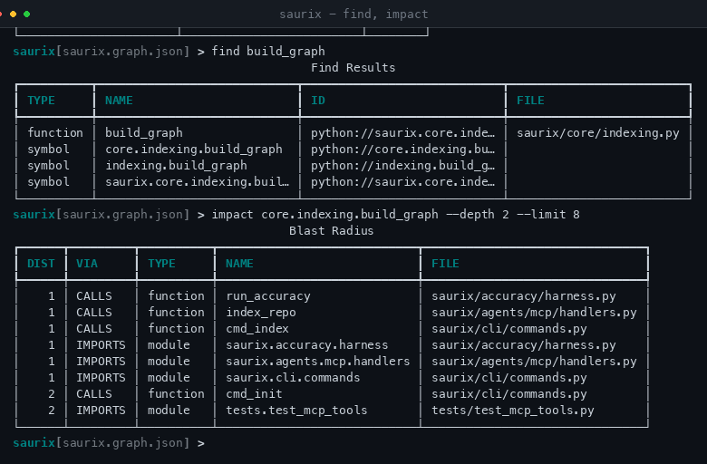
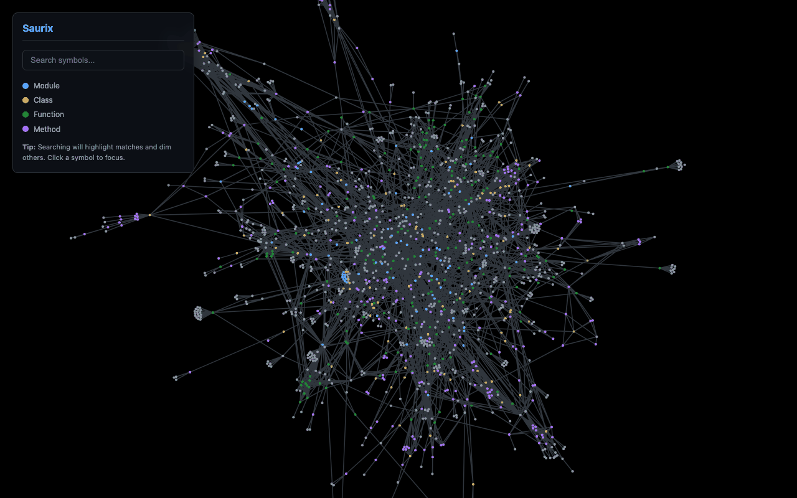
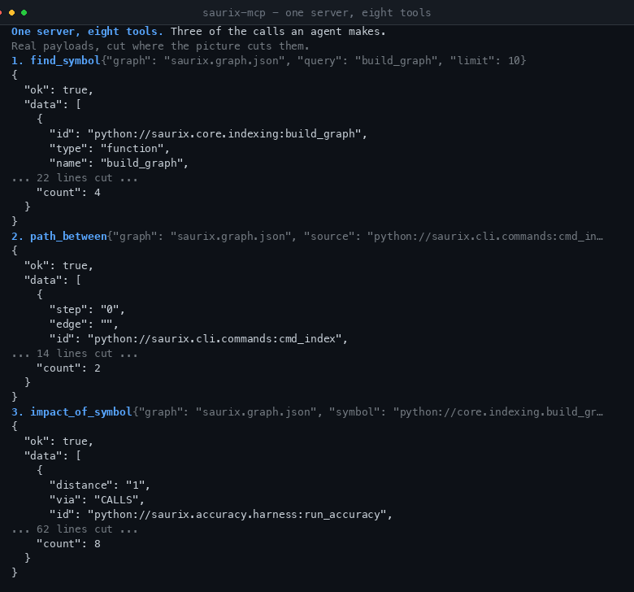

# Saurix

Joining an unfamiliar repo and working out what a change breaks means opening file after file. Saurix indexes the repo into a knowledge graph you can query, so the answer comes from one lookup instead of fifty file reads.

It plugs into Claude Desktop, Cursor, and OpenCode through the Model Context Protocol. `saurix-mcp` serves the graph and your agent asks the questions.

[](https://pypi.org/project/saurix/)
[](https://pypi.org/project/saurix/)
[](https://opensource.org/licenses/MIT)
[](https://pypi.org/project/saurix/)

## See it run



| CLI | Dashboard | Agent tools |
| --- | --- | --- |
|  |  |  |

One number to hold or doubt: on `pallets/click` at `874ca2bc`, 7.35% of the calls its own test suite actually made were edges Saurix had inferred. That is precision on observed calls, not recall, and every miss is listed in the open. Method, limits, and the second figure from a hand-labeled sample: [docs/accuracy.md](docs/accuracy.md).

To see the whole loop an agent follows, read [docs/agent-lifecycle.md](docs/agent-lifecycle.md). Every call there ran against a real repo. For why the project exists and where it falls short, read [docs/why-saurix.md](docs/why-saurix.md).

---

## 1. What it does

- **Indexing** turns a local path or a GitHub URL into a Graph of Symbols and Edges. Four Extractors (Python, TypeScript, Go, Java) all parse through tree-sitter.
- **Queries** answer structural questions without reading every file. Find where a Symbol is defined, who calls it, what it reaches, how two Symbols connect, and what a change would touch.
- **Impact** is the reverse reachable set from a Symbol through CALLS and CONTAINS edges. It reads as a blast radius: the files and functions to re-read after an edit.
- **MCP tools** expose all of it to agents, with one response shape everywhere. See section 5.

---

## 2. Architecture

Indexing takes the checkout, sends each file to its language Extractor, and merges the results into a Graph persisted as JSON. Queries, Impact analysis, and the 2D dashboard all read that Graph. Full breakdown: [docs/architecture.md](docs/architecture.md).

---

## 3. Setup

From PyPI:

```bash
pip install saurix
cd /path/to/your/project
saurix init
```

`init` indexes the project, writes the Graph to `saurix.graph.json`, generates the dashboard as `saurix.html`, and prints the MCP config for your client. From a source checkout, run `uv sync` first and prefix the commands with `uv run`.

To serve the Graph to an agent (Claude Desktop, Cursor, OpenCode):

```bash
saurix-mcp
```

The client starts and stops the server on its own. No manual terminal work needed beyond the config `init` printed.

---

## 4. Commands

Inside `saurix`, or as one-shots (`saurix index .`, `saurix stats`):

| Command          | Description                                           |
| ---------------- | ----------------------------------------------------- |
| `init`           | Zero-config setup for the current project             |
| `index <source>` | Index a local path or GitHub URL                      |
| `stats`          | Show graph statistics and extraction coverage         |
| `find <query>`   | Query Symbols by name or id                           |
| `callers <sym>`  | List symbols calling the target                       |
| `callees <sym>`  | List symbols the target calls                         |
| `path <A> <B>`   | Find shortest directed path between two symbols       |
| `impact <sym>`   | Estimate blast radius of a change                     |
| `related <file>` | List files neighbouring one file                      |
| `visual`         | Generate a 2D knowledge graph visualization           |

---

## 5. Agent tools (MCP)

The server exposes eight tools:

| Tool               | Arguments                                | Returns                                       |
| ------------------ | ---------------------------------------- | --------------------------------------------- |
| `index_repo`       | `source`, `out`                          | What was indexed, and where the graph landed  |
| `stats`            | `graph`                                  | Symbol, edge, language, and coverage totals   |
| `find_symbol`      | `graph`, `query`, `limit`                | Symbols whose name or id matches              |
| `callers`          | `graph`, `symbol`, `limit`               | `CALLS` edges pointing at the symbol          |
| `callees`          | `graph`, `symbol`, `limit`               | `CALLS` edges the symbol reaches              |
| `path_between`     | `graph`, `source`, `target`, `max_depth` | The shortest directed walk between two        |
| `impact_of_symbol` | `graph`, `symbol`, `depth`, `limit`      | The reverse neighbourhood of a change         |
| `related_files`    | `graph`, `file`, `depth`, `limit`        | Neighbour files of one file path              |

They answer three kinds of question:

1. **Context discovery**: `find_symbol` and `related_files`.
2. **Behavioral mapping**: `callers`, `callees`, and `path_between`.
3. **Risk assessment**: `impact_of_symbol`.

Every tool answers with the same envelope: `ok`, then either `data` or an
`error` of `code` and `message` (never both), then `meta` with the
`duration_ms` the call took. Tools that answer with rows add a `count` of them.
A failure is timed like a success, so the shape does not change with the outcome.

Reading a graph, or looking something up in it, fails the same way whichever
tool was asked:

| Code               | Meaning                                                        |
| ------------------ | -------------------------------------------------------------- |
| `GRAPH_NOT_FOUND`  | No graph at the path given, and none at the default path either |
| `INVALID_GRAPH`    | The file is not valid JSON, or not a Saurix graph              |
| `GRAPH_UNREADABLE` | The path exists but could not be read                          |
| `SYMBOL_NOT_FOUND` | The graph holds no symbol with the name or id given            |
| `FILE_NOT_FOUND`   | The graph holds no symbol belonging to the file path given     |
| `INVALID_SOURCE`   | `index_repo` was pointed at neither a path nor a GitHub URL     |

Two more sets of codes come from the tool's own work rather than its arguments:
`index_repo` reports `SOURCE_NOT_FOUND`, `PERMISSION_DENIED`, or `INDEX_FAILED`,
and a query that fails underneath a tool it had already accepted reports
`STATS_FAILED`, `FIND_FAILED`, `CALLERS_FAILED`, `CALLEES_FAILED`,
`PATH_FAILED`, `IMPACT_FAILED`, or `RELATED_FAILED`.

A Query that matches nothing is not one of these: `find_symbol` returns an
empty list, and so does a `path_between` whose two ends the graph holds but
does not connect. A tool asked about a *specific* symbol is stricter, and
reports `SYMBOL_NOT_FOUND` rather than guessing which one was meant. Pass an id
from `find_symbol` if a name is not enough.

A runnable copy of every call, with real responses, lives in
[demo-mcp.md](demo-mcp.md). It is generated from a live server run, so copy
any of it and it works.

---

## 6. Development

### Running tests

```bash
uv run pytest
```

### Regenerating the documentation

The tool-call demo ([demo-mcp.md](demo-mcp.md)) and the agent walkthrough
([docs/agent-lifecycle.md](docs/agent-lifecycle.md)) are generated from a real
run of the MCP server against this repository, so every identifier in them is
one a reader can copy. Refresh them after touching the code or the tool surface:

```bash
uv run scripts/generate_mcp_demo.py
```

`--check` reports drift without writing. `tests/test_docs.py` re-runs the
generator on every test run and fails when the committed documents no longer
match the current code, or when any document names a module or file path that
no longer exists.

### Checking call edge accuracy

How accurate the inferred call edges are is measured, not asserted. The
accuracy report ([docs/accuracy.md](docs/accuracy.md)) pins a target repository
to one commit, traces its own test suite at runtime, and reports how many of
the calls that really happened the pipeline also inferred. A hand-labeled sample
covers the region no test reaches, and is reported as a second figure rather
than folded into the first. Regenerate it with:

```bash
uv run scripts/accuracy.py
```

It is a published snapshot, not a CI gate: it clones a foreign repository and
builds an environment for it, which is too slow and fragile to run on every
push. The report says so, and says what it would take to change that.

### Testing the MCP server

You can test the MCP integration without a full IDE using the **MCP Inspector**:

1. **Install the Inspector**: `npm install -g @modelcontextprotocol/inspector`
2. **Run the Server**: `npx @modelcontextprotocol/inspector uv run saurix-mcp`
3. **Interact**: Open `http://localhost:5173`, click **Connect**, and use the **Call Tool** tab.

For step-by-step setup (Claude Desktop, Cursor, OpenCode), simply run `saurix init` in your project folder.

---

_Saurix is built for the era of autonomous coding._
